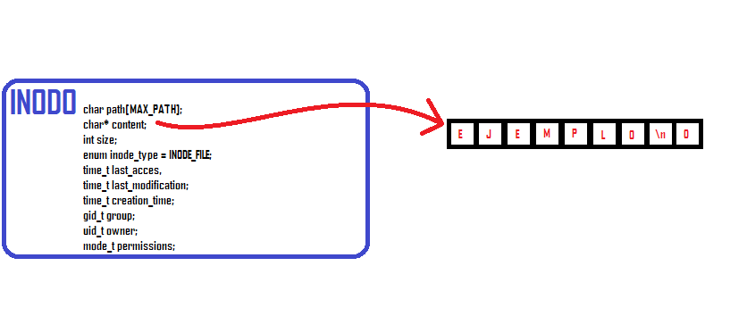
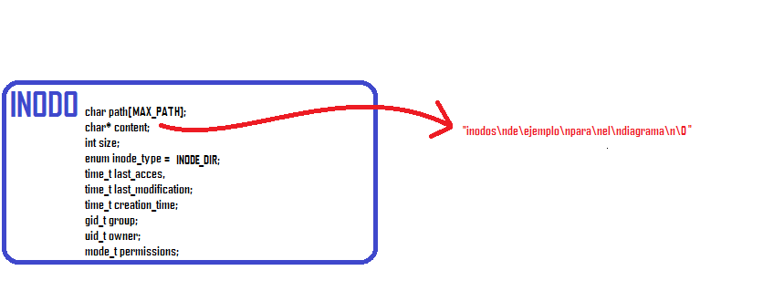
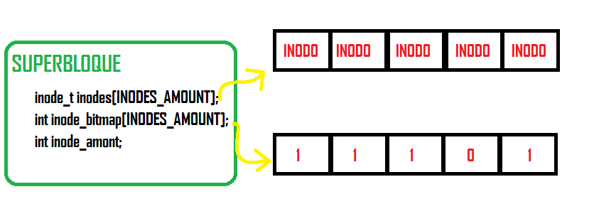

# fisop-fs

## Explicación y justificación de las estructuras utilizadas

Para representar a los archivos, implementamos una estructura `inode_t` que almacena toda la información de un archivo.

Esta estructura `inode_t` puede ser de tipo directorio o de tipo archivo, y su funcionamiento es igual independiente del tipo.

El inodo almacena el path del archivo, en un array de chars, y como a priori no podemos definir cuánto va a ocupar cada archivo, su contenido está definido como un puntero a char que va a ser asignado con memoria dinámica al momento de crear un archivo.

Además, esta estructura almacena el tamaño del archivo, su tipo (directorio o archivo), y una serie de metadatos del archivo en si, estos son: el último acceso al archivo, la última modificación del mismo, cuándo fue creado, su id de grupo, el id del usuario que lo creó y por último los permisos que tiene para realizar operaciones. 

Estos inodos están almacenados en una estructura `superblock_t`.

Esta estructura es la que almacena toda la información de todos los inodos, sean del tipo que sean, del filesystem.

La estructura implementa un array de `inode_t`.

Cada una de las entradas de este array, es un archivo, y la cantidad máxima de archivos que puede tener nuestro filesystem es de 1024, y fue elegida porque era el número más frecuente en los ejemplos de las clases teóricas.

Este `superblock` tiene también un bitmap de sus inodos, representado como un array de enteros.

Estos enteros solo toman valores de 0 o 1, que indican si un inodo está en uso o no. Por ejemplo si `inode_bitmap[17] == 1`, entonces quiere decir que `inodes[17]` va a ser un inodo creado, en cambio si `inode_bitmap[73] == 0`, entonces quiere decir que esa entrada del array de inodos no es un archivo creado.

Por último el superbloque también almacena cuántos inodos están en uso en un momento determinado del filesystem. Cabe aclarar que el superbloque está definido como una variable global en los archivos implementados, cosa de que las funciones lo puedan utilizar sin tener que estar enviandolo por parámetro. 

Para encontrar un archivo en el filesystem, dado un PATH determinado, se utiliza la función `int search_inode(const char *path)` que se encuentra en `fs.c`. Esta función recorre secuencialmente el superbloque.

Para cada archivo chequea 2 cosas, primero que el valor del `inode_bitmap` en el ìndice de dicho archivo no sea 0, es decir que no sea un archivo vacío, y en segundo lugar compara el valor del _path_ recibido por parámetro contra el valor del _path_ del archivo en el índice actual del array de inodos del superbloque.

Si alguna de las 2 comparaciones resulta ser falsa, entonces se sigue con el siguiente archivo, en cambio si ambas se cumplen la función devuelve el índice del array de inodos del superbloque en el que se encuentra el archivo con el _path_ buscado. Si no llegara a encontrarse un archivo con dicho _path_, la función devuelve error (-1).

## El formato de serialización es el siguiente:
* Se escribe en disco la cantidad de inodos creados que tiene el superbloque (almacenados en `superblock.inode_amount`)
* Luego para cada inodo, si el valor de su índice en el bitmap es 1 (o sea que es un inodo válido) se hacen 2 escrituras en disco: primero se escriben los valores de todos los atributos del inodo, y luego se hace una segunda escritura con el contenido del inodo. Esto se hace ya que, como se menciona al principio cuando se describió su estructura, el contenido está almacenado en un `char*`, por lo que cuando se escriben todos los atributos del inodo, no se escribe su contenido, sino el valor de la dirección de memoria donde comienza ese contenido. Esto no es conveniente porque luego de serializar los datos y finalizar `fuse`, se pierde toda la memoria pedida para los inodos, y una vez que se vuelva a montar el filesystem y se haga la deserialización para volver a cargar todos los archivos, se va a leer esa dirección de memoria que se cargo, en donde ya no se encontrará el contenido del archivo o directorio, causando que se borre para siempre. Es por esto que primero se graban todos los atributos del inodo, y luego se hace una segunda escritura con su contenido. Entonces a la hora de deserializar la información, se va a leer primero toda la información del inodo, incluyendo un contenido (que va a ser una dirección de memoria que vamos a ignorar), y luego se hace una segunda lectura para poder restaurar el contenido correcto del archivo o directorio.

## Diagramas

A continuación, se añaden unos diagramas representativos a las estructuras antes explicadas.

### Diagrama de INODO del tipo "FILE"

### Diagrama de INODO del tipo "DIR"

### Diagrama del superbloque

