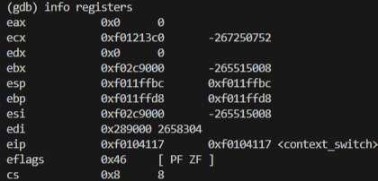
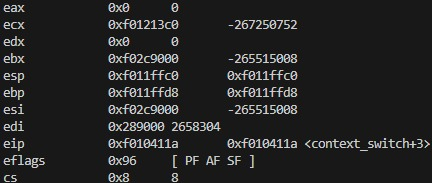
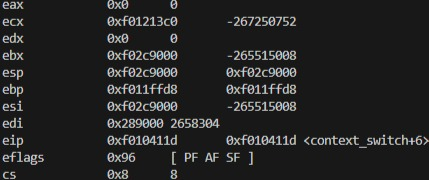
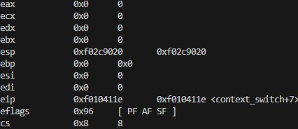
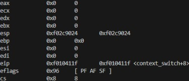
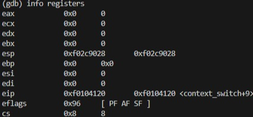
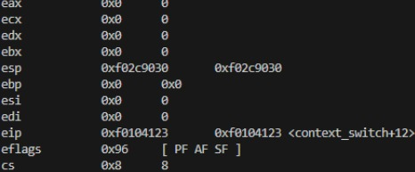
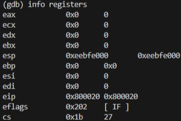

# sched

## Informe Grupo 1

### Utilizar GDB para visualizar el cambio de contexto

Cuando se llama a la función `context_switch`, el sistema operativo está cambiando el contexto de ejecución a un proceso diferente. Para poder analizar el procedimiento, primero modificamos _kern/init.c_ de forma temporal, para ejecutar un único proceso `user_hello` de ejemplo y, usando GDB, visualizamos el cambio de contexto explicándolo paso a paso.

Primero pondremos un breakpoint en `context_switch`, avanzamos la ejecucion hasta ese punto y observamos el estado del stack.

En la pila se tienen (en este orden):

*Dirección de retorno:* La dirección de retorno es la dirección a la que el programa regresaría cuando `context_switch` termine.

*Trapframe:* El argumento `&e->env_tf` es la dirección del trapframe que contiene el estado de los registros que se van a restaurar.

*add $4, %esp:* Este ajuste de 4 bytes en `%esp` es para saltar la dirección de retorno que fue colocada automáticamente en la pila cuando se llamó a `context_switch`. Dado que no se necesita esta dirección (se usa iret para restaurar el contexto), se mueve el puntero de pila para ignorarla.

Ahora `%esp` apunta al argumento que se pasó a la función, que es la dirección del trapframe. Ver que el valor del registro esp en la imagen (1) es `f011ffbc`, que al sumarle  4 bytes da como resultado `f011ffc0` (coincide con lo visto en esta imagen).

mov (%esp), %esp:  Esta instrucción cambia el valor del registro `esp` con el valor almacenado en la posición de memoria apuntada por dicho registro  (es decir, el contenido de `&e->env_tf`, que es el trapframe). Lo que estamos haciendo es preparar la pila para que los registros se restauren desde esta estructura en los siguientes pasos.

Observar que el registro esp cambia de valor, ya que ahora apunta al contenido del trapframe, lo cual servirá para ejecutar la siguiente instrucción.

*popal:* La macro popal sirve para restaurar todos los registros de propósito general desde la pila, en un orden específico. Para que funcione correctamente, %esp debe apuntar a la estructura de la pila que contiene los valores de esos registros. Por eso en el paso anterior se ejecutó mov (%esp), %esp.

| ... otros datos ...                   	|

| EAX (registro del trapframe)            |  <-- %esp apunta aquí

| ECX                                   	|

| EDX                                   	|

| EBX                                   	|

| EBP                                   	|

| ESI                                   	|

| EDI                                   	|

| ... otros datos ...                   	|

Observar que los registros de uso general se actualizaron una vez que se ejecutó popal.

*pop %es:* Saca el siguiente valor de la pila y lo coloca en el registro de segmento `%es`, y ajusta `%esp`.

Observar que se modifican los registros correspondientes (esp cambia de `f02c9020` a `f02c9024` ya que se pasa a la siguiente dirección (cada una tiene 4 bytes), mientras que el registro: es pasa de un valor de 16 a 35).

*pop %ds:* Hace lo mismo que el paso anterior pero para el registro de segmento `%ds`.

Al registro esp se le suman 4 bytes ya que se pasa a la siguiente dirección, mientras que el registro: ds pasa de un valor de 16 a 35.

*add $8, %esp:* Esta instrucción le suma (incrementa) al puntero de pila `%esp` 8 bytes para saltear los registros err (Código de error) y trapno (Número de trampa o interrupción) que no requieren ser restaurados manualmente.

+------------------+

| err      	  |   <- Código de error (si aplica)

+------------------+

| trapno      |   <- Número de la interrupción o trampa

+------------------+

| EFLAGS      |   <- Registros de banderas

+------------------+

| CS        	|   <- Segmento de código

+------------------+

| EIP         |   <- Dirección de retorno

+------------------+

| Registros   |   <- Otros registros del CPU (guardados por popal)

+------------------+

Ver que `f02c9028` (el valor del registro esp en la instrucción anterior) al sumarle 8 bytes da como resultado `f02c9030` coincidiendo con el valor mostrado en la imagen superior.

*iret:* Es una instrucción que se utiliza para restaurar el contexto completo de un proceso interrumpido y volver a la ejecución del programa en el espacio de usuario. Ver en la imagen inferior que se modifican (de la imagen anterior).

*Puntero de Instrucción (EIP o RIP):* Registro que indica la dirección de la siguiente instrucción a ejecutar. 

*Registro de Estado (EFLAGS o RFLAGS):* Restaura el registro de estado que contiene las banderas del procesador. Permite que el procesador regrese al mismo estado en el que estaba antes de la interrupción. (Cambia de 0x96 a 0x202)

Demás registros de segmentos (ss por ejemplo cambia de valor de 16 a 35).

---

### Explicar y describir la lógica de la implementación en el scheduler por prioridades

#### Estructura del Scheduler
El scheduler se basa en la utilización de cuatro colas de prioridad (A, B, C, D), donde cada cola almacena los procesos según su nivel de importancia. Se define una variable global que contiene la instancia del scheduler y una estructura que almacena los IDs de los procesos, el primer proceso en cola, el último proceso en cola, y un valor que controla el número total de ejecuciones.

Además, se establece un tope de ejecuciones totales (en este caso, 50), lo que asegura que, después de alcanzar este límite, se realice una promoción de procesos entre las colas para permitir que aquellos de baja prioridad puedan ser ejecutados.

#### Funciones Implementadas

Las funciones principales que gestionan el comportamiento del scheduler son las siguientes:

- `sched_eliminar_env`: Esta función busca en la cola correspondiente el ID del proceso proporcionado y, si se encuentra, lo elimina.

- `sched_agregar_env`: Agrega el ID de un proceso a la cola correspondiente e incrementa el contador de la posición final de la cola. Esta función permite manejar colas de gran tamaño sin afectar el rendimiento.

- `sched_yield`: Se ejecuta cada vez que el scheduler es invocado, aumentando la cantidad de ejecuciones totales del scheduler.

#### Proceso de Ejecución del Scheduler

Al iniciar el scheduler, todas las colas se inicializan en cero. Cada vez que se ejecuta el scheduler, se verifica el número de ejecuciones acumuladas. Si este número es igual al límite preestablecido (50 ejecuciones), se invoca la función de promoción de colas. Esta función permite que los procesos en colas de baja prioridad escalen a colas de mayor prioridad, asegurando que puedan ser ejecutados.

El proceso de promoción reordena los procesos de las colas B, C y D, moviéndolos hacia la cola A para que puedan tener mayor oportunidad de ser ejecutados. Una vez realizado este proceso, el contador de ejecuciones totales se reinicia a cero.

#### Mecanismo del Scheduler

El scheduler sigue los siguientes pasos en su funcionamiento:

- Búsqueda de proceso actual: El scheduler busca el proceso en ejecución actual y determina cuál es la cola de mayor prioridad con procesos listos para ser ejecutados.

- Obtención de cola: El scheduler asigna un número a cada cola (de 0 a 3, correspondientes a A, B, C y D), y verifica si alguno de los procesos en la cola está en estado "runnable". Si se encuentra un proceso en este estado, devuelve su posición en la cola.

##### Casos a gestionar:

- No hay cola de mayor prioridad disponible: Si no hay procesos en colas de mayor prioridad, el scheduler verifica si el proceso actual está en ejecución. Si lo está:

  - Se incrementan las ejecuciones totales del scheduler y del propio proceso.
  - Se ejecuta el proceso. En caso contrario, el scheduler se detiene (scheduler halt).
- Hay cola de mayor prioridad disponible: El scheduler itera sobre los procesos en estado "runnable" en dicha cola. Cada vez que se ejecuta un proceso:

  - Se reduce su nivel en las colas de prioridad.
  - Se incrementan las ejecuciones totales del scheduler y del proceso.
  - Después de ejecutar un proceso, el scheduler realiza un cambio de contexto (context switch).

##### Promoción de colas:

Tras 50 iteraciones o cuando se vacía la cola de mayor prioridad utilizada, se promueven las colas. Las colas B, C y D se promueven progresivamente a la cola A, asegurando que los procesos mantengan su prioridad inicial. Al finalizar la promocion de borran las colas B,C y D para asegurarse que no hayan elementos que molesten el proceso de reduccion de promocion de futuros procesos.
